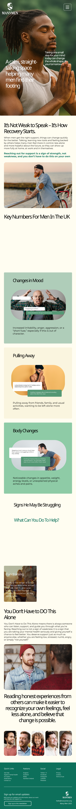
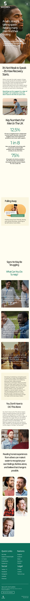

Many Men – Men Matter
A calm, straight-talking, single-page website supporting men’s mental health and wellbeing, built as a first solo HTML/CSS/Bootstrap project from a Code Institute skills assessment.

Live Site: https://denmurray10.github.io/Many-Men/
Repository: https://github.com/denmurray10/Many-Men

Overview
Many Men is a responsive, single-page site that offers beginner-friendly information about men’s mental health, key warning signs, and practical ways to seek or offer support.

It was developed as a Code Institute assessment project to demonstrate HTML, CSS, Bootstrap and basic JavaScript skills while also serving as a portfolio-ready, real-world style landing page.

User Experience (UX)
Project Goals
External user goal: Provide accessible, beginner-friendly information on mental health, including common issues, signs and basic ways to manage stress, presented in a supportive and organised layout.

Site owner goal: Build a calm, welcoming webpage using HTML, CSS and Bootstrap that demonstrates responsive layouts, card-based content, and form handling while maintaining a reassuring tone.

Target Audience
Men who may be struggling with their mental health and need a gentle, low-barrier way to learn more.

Friends, partners, colleagues and family members who want to recognise signs that a man might be struggling and know how to support him.

Tutors, assessors and potential employers who want to see practical application of HTML, CSS, Bootstrap 5.3.8 and basic JavaScript in a real-world concept.

Core User Stories (Met)
Understand the site and its purpose
As a first-time visitor, I want to immediately understand what the site is about and feel reassured that it is a calm, supportive space for men’s mental health so that I feel safe exploring further.

Get beginner-friendly information on men’s mental health
As someone who is new to mental health topics, I want clear, beginner-friendly explanations and key facts so that I can understand what men commonly struggle with and why support matters.

Recognise signs that a man may be struggling
As someone worried about myself or another man, I want to recognise common signs that someone may be struggling so that I can decide whether support or a conversation might be needed.

Know what I can practically do to help
As someone who wants to support a man in my life, I want practical guidance on what I can do so that I feel less helpless and can take useful, concrete steps.

Access external support and resources easily
As a user who may need more specialised support, I want clearly presented links to trusted external resources so that I can quickly find professional information and help.

Reach out, connect, and stay informed
As a user who feels ready to take a small step, I want simple ways to reach out or stay connected (e.g. a contact form or newsletter) so that I don’t feel I am dealing with everything alone.

Additional (Lower Priority) Stories (Met)
Browse comfortably on any device – Responsive Bootstrap grid, fluid images and a collapsing navbar ensure content is usable on mobile, tablet and desktop.

Read content that is visually calm and accessible – A soft colour palette, consistent typography, and generous spacing help reduce overwhelm and make long-form content more readable.

Navigate without the navbar feeling intrusive – The navbar adapts on scroll, auto-hides after inactivity and collapses on mobile link click, balancing visibility with unobtrusive reading.

Future User Stories (Not Yet Implemented)
Quickly access urgent crisis support – Future plan for a prominent “In crisis?” panel or button linking directly to 24/7 crisis services and clear instructions.

Save or print a simple self-help plan – Future plan for a “Your self-help plan” section with a print-friendly or downloadable summary of chosen coping steps and crisis contacts.

Features
Key Sections
Hero section: Sets the tone with the site title, supportive tagline and primary call-to-action, welcoming users into a calm, non-judgemental space.

Statistics section: Highlights core men’s mental health statistics in the UK with clear explanations to show scale and urgency.

Signs he may be struggling: Card-based section using images and concise descriptions to help users recognise behavioural, emotional and physical signs.

Guidance content: Longer-form guidance explaining how to seek help, who to talk to and how to support others, written in approachable language.

Testimonials-style stories: Human-centred narratives that demonstrate different types of struggle and recovery paths to help visitors feel less alone.

Quick links and resources: Structured lists of external resources, including national-specific links, legal information and social channels.

Get help modal: A supportive modal that offers guidance text plus a contact form with validation and a success message.

Newsletter sign-up: A dedicated modal styled for clarity, with name/email fields and a success alert to encourage ongoing engagement.

UI and Interaction
Responsive navbar with brand, section links and mobile collapse.

Scroll and activity-based navbar behaviour to reduce distraction while keeping navigation accessible.

Hover effects and overlays on imagery to add subtle feedback without overwhelming the calm design.

Smooth layout and spacing using Bootstrap grid and utility classes.

Technologies Used
HTML5 – Semantic structure for sections, headings, forms and content.

CSS3 – Custom styling for layout, colour palette, typography, cards, overlays and modals.

Bootstrap 5.3.8 – Responsive grid, navbar, cards, modals and utility classes.

JavaScript (vanilla) – Handling navbar behaviour, inactivity-based auto-hide, form validation checks and success message toggling.

Tools and Workflow
Git & GitHub – Version control and code hosting.

GitHub Pages – Static site deployment at https://denmurray10.github.io/Many-Men/.

Design inspiration: Layout references from Dribbble and Envato Elements, with the final layout designed and implemented by the developer.

AI assistance: Used to validate HTML structure, refine modal and form logic, and review for potential mistakes or incomplete tags, while ensuring final code and content decisions remained human-guided.​

## Design & Wireframes

The design focuses on delivering a calm, supportive experience with clear hierarchy and generous spacing, reflecting the subject matter and the developer’s marketing/design background.

### Wireframe and Layout Previews

  
  
  

These images demonstrate how the core content, navigation and call-to-action elements adapt across key breakpoints, ensuring readability and ease of use on different devices.

Accessibility
Accessibility considerations include:

Semantic HTML elements to support screen readers and document structure.

Colour choices aimed at maintaining sufficient contrast between text and background.

Clear, descriptive headings and link text so users can scan quickly.

Form inputs with associated labels and validation feedback to help users understand and correct errors.

Further improvements are planned, including deeper keyboard navigation checks, ARIA enhancements for modals, and more systematic use of alt text where relevant.

Testing
Manual Testing
The site was manually tested in modern desktop and mobile browsers to verify:

Navigation links scroll to the correct sections and the navbar behaves as expected on scroll and inactivity.

All main sections render correctly at common screen sizes without horizontal scrolling.

Forms in the Get Help modal and newsletter modal accept valid input, reject invalid input and display success messages appropriately.

Validation
HTML: Checked using the W3C HTML Validator; no critical errors.

CSS: Checked using the W3C CSS Validator; no syntax errors.​

Validation Screenshots
Screenshots of successful validation are included for transparency:

#### Validation Screenshots

  
  

Feature-Level Checks
Navbar: links, scroll behaviour and mobile toggle.

Cards and hover states: overlays and text readability.

Modals: open/close behaviour across multiple interactions.

Forms: required fields, email format, minimum message length, success alerts and reset behaviour.

Deployment
The site is deployed with GitHub Pages:

Code is stored in the main branch of the repository.

GitHub Pages is configured to serve the site from this branch.

The live site is available at: https://denmurray10.github.io/Many-Men/.

Updates are made locally, committed to Git, pushed to GitHub, and GitHub Pages automatically redeploys the latest version.​

Known Issues / Limitations
Minor layout quirks may appear on very narrow screens and will be refined in future iterations.

The Get Help and newsletter forms currently simulate submissions on the front end and do not send real emails or store data.

Additional accessibility testing with screen readers and ARIA labelling for modals is still planned.

Some transitions may feel slightly abrupt on lower-powered devices and will be tuned further.

Future Enhancements
Dedicated “In crisis?” banner and section with clearly highlighted 24/7 crisis support routes.

Printable or downloadable “self-help plan” summarising key steps and resources for offline use.

Deeper accessibility refinements and testing across assistive technologies.

Potential expansion into multi-page content or interactive tools if the project is extended.

Credits & Acknowledgements
Training & assessment: Code Institute – for the learning materials, project brief and assessment framework.

Content research: Mental Health Foundation and similar reputable mental health organisations, used to research themes, statistics and support pathways; all external resources are linked to their official websites rather than copied.

Copy development: Key themes and topics were researched using Mental Health Foundation resources, and draft wording was generated with AI and then edited into original text for this project.

Design inspiration: Visual and layout inspiration taken from Dribbble and Envato Elements; final layout and styling decisions were created by the developer.

Developer: First fully self-coded responsive site by an aspiring full-stack developer with a marketing and design background, focused on supporting men’s mental health.
